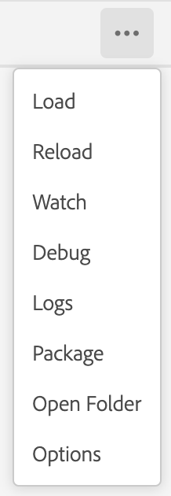

# Debugging UXP Plugins

Although you'll certainly write your plugin code so that it has zero bugs, it is sometimes handy to know how to use the debugging tools available with UXP.

## Debugging Tools
There are two ways to debug. The simplest way, suitable for many plugins, is to use the UXP Developer Tool. After a plugin has been loaded in the Developer Tool, choose `Debug` from the Actions menu for the plugin (on the far right of the Developer Tool window).

The other way, if you've loaded your plugin using the command-line tools, is to use [Chrome DevTools](https://developers.google.com/web/tools/chrome-devtools/javascript), as follows:

In a new Chrome window, navigate to `chrome://inspect`. Press Configure... next to Discover network targets checkbox, and add localhost:xxxx (where "xxxx" is the port you declared in your debug.json file). 

When the extension is loaded, it should show up with its ID on this page.

Make sure that you check `Pause on caught exceptions` in the Chrome debugger (on the right side of the `Sources` tab). 

The Chrome debugger arguably has more features than the UXP Developer Tool, but many of those features are not applicable in the UXP environment. The best thing about the UXP Developer Tool is that you can choose `Reload` from the Actions menu whenever you've changed your code; no need to quit and re-launch anything.

## Why Doesn't My Plugin Work?

You've just written a UXP plugin that will change the world and make you famous (in a geek-culture kind of way). But it doesn't work! Why not?

### Manifest Problems
The JSON format is known for being easier for humans to read than XML. That doesn't mean it's easy, though. The smallest glitch in your JSON manifest file (a misplaced bracket, a missing comma, etc.) will cause your plugin to fail to load. You can use a JSON linter (one is built into VS code, and there are many available online both as apps and built into websites).

### Installation Problems
During the beta period for Photoshop UXP, there were a variety of ways to get plugins into the directory where Photoshop could find them. Now, there is just one approved way to bring your development plugin into Photoshop: the [UXP Developer Tool](../uxp-developer-tool/index.md).

### Entry Point Problems
If your plugin fails to run due to a JavaScript error, usually that error will show up in the debugger console. Like most error messages since the dawn of the computer age, sometimes the error message is buried in a cryptic stack trace, but it will definitely be in there.

### CSS Problems
Although the browser that underlies UXP supports common HTML/CSS use cases that enable a rich UI for plugins, there are some aspects of those languages that it doesn't support, or where the behavior is limited and/or different.

Troubleshooting CSS is a full-time job for some web developers. For UXP plugins, it's not as bad because the CSS is only targeting one "browser." On the other hand, CSS bugs are often difficult to track down.

### Not Watching
The UXP Developer Toolkit has a great "watch" feature that automatically reloads your plugins when (almost) any of the files in your plugin folder change. But unless you enable this watch feature (by selecting `Watch` in the Actions column), nothing will change in Photoshop when you save a change to one of your files while editing.

You can always reload your plugin manually, but it's nice when the system does it for you.

### Gremlins
Sometimes, restarting Photoshop and the UXP Developer Tool will make a problem mysteriously vanish. Why does this happen? Yes, yes it does.

__TBD: WHAT ELSE SHOULD GO HERE OR ON A SEPARATE PAGE?__